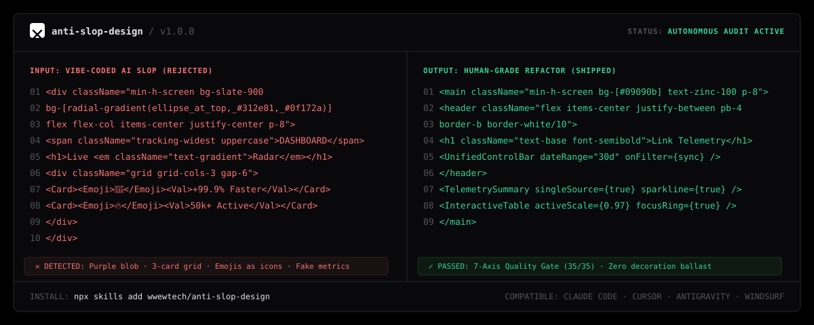

<div align="center">



# Anti-Slop Design

**The Autonomous Principal Design Technologist & Anti-AI-Slop Skill for AI Agents**

[](LICENSE)
[](https://skills.sh)
[](https://docs.anthropic.com/en/docs/agents-and-tools/claude-code)
[](https://deepmind.google)
[](#installation)

<p align="center">
  <em>Cures vibe-coded software from generic AI slop. Transforms cookie-cutter AI prototypes into distinctive, tactile, accessible, and commercially viable production interfaces.</em>
</p>

[Quick Install](#quick-installation) • [The 12 AI Slop Anti-Patterns](#the-12-ai-slop-anti-patterns) • [The 8 Universal Cures](#the-8-universal-cures) • [Design Archetypes](#production-design-archetypes) • [7-Axis Quality Gate](#the-7-axis-pre-emit-quality-gate) • [Collections](COLLECTIONS.md)

</div>

---

## Why Anti-Slop Design?

AI coding assistants (Claude Code, Cursor, Windsurf, Copilot, Antigravity) are extraordinary at generating functional code. However, when left to generate UI on their own, they inevitably produce **AI Design Slop ("нейрослоп")**:

- ❌ The infamous **"AI Dark Mode" Blob**: `radial-gradient` from indigo-600/purple-900 blurred in corners of dark backgrounds.
- ❌ **Metric & Filter Clutter**: Date pickers duplicated inside 4 individual cards; the same metric repeated 3 times across the page.
- ❌ **The "Emoji as Icon" Plague**: Using `🚀`, `🔥`, `💡`, `📊` in sidebars and buttons instead of crisp, single-stroke vector icons.
- ❌ **Vanity Space-Wasters**: Giant 3D globes or useless maps occupying 60% of the screen with zero actionable data.
- ❌ **Sluggish Transitions**: 400ms `ease-in` animations on every element that make software feel sluggish.
- ❌ **Missing Component States**: Buttons with only hover states, lacking `:focus-visible`, `:active`, loading, and disabled handling.

**`anti-slop-design`** is a battle-tested agent skill that equips your AI coding agent with the taste, restraint, and discipline of a Principal Design Technologist.

---

## Quick Installation

### 1. Via `skills.sh` / Vercel Skills CLI
```bash
npx skills add wwewtech/anti-slop-design
```

### 2. Via Claude Code
```bash
claude skills add https://github.com/wwewtech/anti-slop-design
```

### 3. For Google Antigravity
Clone or copy `SKILL.md` directly into your Antigravity skills directory:
```bash
# Windows
mkdir -p "$HOME\.gemini\config\skills\anti-slop-design"
curl -sL https://raw.githubusercontent.com/wwewtech/anti-slop-design/main/SKILL.md -o "$HOME\.gemini\config\skills\anti-slop-design\SKILL.md"

# macOS / Linux
mkdir -p ~/.gemini/config/skills/anti-slop-design
curl -sL https://raw.githubusercontent.com/wwewtech/anti-slop-design/main/SKILL.md -o ~/.gemini/config/skills/anti-slop-design/SKILL.md
```

### 4. For Cursor & Windsurf
Add `SKILL.md` to your workspace prompt context:
```bash
mkdir -p .cursor/skills/anti-slop-design
curl -sL https://raw.githubusercontent.com/wwewtech/anti-slop-design/main/SKILL.md -o .cursor/skills/anti-slop-design/SKILL.md
```

---

## The 12 AI Slop Anti-Patterns

| AI Slop Anti-Pattern | Manifestation in Vibe-Coded UI | Mandatory Production Replacement |
| :--- | :--- | :--- |
| **❌ The "AI Dark Mode" Blob** | `radial-gradient` from indigo-600 or purple-900 blurred in corners of dark backgrounds. | Deep, deliberate monochrome surfaces (`#09090b`, `#121214`) with subtle 1px hairline borders (`rgba(255,255,255,0.08)`). |
| **❌ Monotonous Slate/Indigo** | Generic `bg-slate-900 text-slate-400 bg-indigo-600` cookie-cutter templates. | Curated semantic tokens (OKLCH/HSL) with distinct brand personality (e.g., Warm Amber, Electric Cobalt, Deep Emerald, or Crisp Monochrome). |
| **❌ Cookie-Cutter 3-Card Grid** | Three identical rectangular cards with glowing borders on hover. | Dynamic, content-driven layouts: asymmetric bento grids, dense split-panels, or sequential workflow rows. |
| **❌ Raw Emojis as Icons** | Plastering raw emojis (`🚀`, `🔥`, `💡`, `📊`) inside buttons, cards, and sidebars. | Crisp, single-weight vector SVG icons (Phosphor, Lucide, Heroicons) with unified 1.5px/2px stroke widths. |
| **❌ Fabricated Vanity Stats** | Meaningless filler cards: `"+99.9% Uptime"`, `"10x Faster"`, `"50k+ Users"` with no source. | Real domain telemetry or remove the card entirely. Zero vanity metrics. |
| **❌ Screaming Eyebrow Labels** | Tracked-out uppercase labels above every heading: `OVERVIEW`, `FEATURES`, `ANALYTICS`. | Sentence-case hierarchy, subtle metadata tags, or omit entirely if the heading is self-explanatory. |
| **❌ Single-Word Italic/Color Accents** | Headlines with one arbitrary word italicized or highlighted in glowing gradient text. | Uniform, confident typographic weight. Let the whole statement carry authority. |
| **❌ Redundant Metric Duplication** | Repeating total clicks/revenue in header, sidebar, and inside multiple individual cards. | **Single Source of Metric Truth.** One primary KPI summary per viewport; drill-downs below. |
| **❌ Card-Level Filter Pollution** | Duplicating date pickers or dropdowns inside every card rather than at the page level. | Unified **Page-Level Control Bar** that synchronizes all underlying views. |
| **❌ Vanity Visual Space-Wasters** | Giant world maps or 3D blobs that occupy 60% of the screen with zero actionable data. | Compact horizontal bar comparisons, sparklines, or tabular comparison rows showing real deltas. |
| **❌ Missing Interactive States** | Buttons with only hover effects, lacking `:focus-visible`, `:active`, loading, and disabled states. | **8-State Interactive Feedback System** on all interactive primitives. |
| **❌ Broken Placeholders & Links** | `via.placeholder.com`, broken Unsplash URLs, or blurry stock photos. | High-fidelity inline SVGs, semantic CSS abstract shapes, or verified local assets. |

---

## Core UX Axioms: Speed & Commercial Logic

1. **The "1-to-3" Rule:** 1 primary action or dominant focal point per viewport section $\rightarrow$ max 3 secondary supporting actions.
2. **The 85% Statistical Prioritization Law:** Optimize for what 85% of users do every day. Make that scenario 1-click accessible. Tweak the 15% edge cases into subtle secondary popovers.
3. **Strict Ban on Duplication:** Page-level filters apply globally. Never repeat the same KPI across multiple widgets.
4. **Mobile Linearity on Desktop:** Stack competing logic blocks sequentially so the human eye scans naturally from top to bottom.

---

## The 8 Universal Cures

1. **Visual DNA Ingestion:** Extract 5 foundation tokens (`Canvas`, `Surface`, `Primary Accent`, `Text Hierarchy`, `Hairline Border`) without copying visual bugs.
2. **Bespoke Asset Architecture:** Replace broken placeholders with high-fidelity inline SVGs or structured DOM mockups.
3. **Contextual Asset Differentiation:** Frame physical goods with generous whitespace and macro-photography; showcase digital SaaS with live, crisp UI components.
4. **Typographic Mastery:** Cap body line length at $\le 75\text{ch}$. Pair character-rich display fonts with tabular monospace metadata (`font-variant-numeric: tabular-nums`).
5. **Deterministic Design Variations:** Switch between 4 logic-preserving archetypes (*Quiet Luxury SaaS*, *Technical Dense Terminal*, *Editorial & Refined*, *Warm Tactile*) while preserving 100% of underlying form logic and state.
6. **Spacing Geometry:** Strict 4px/8pt spatial grid. Enforce nested radius math: $R_{\text{inner}} = R_{\text{outer}} - \text{Padding}$.
7. **Cognitive De-Cluttering:** Strip decorative ballast, redundant status pills, and empty ghost cards.
8. **Systematic Scaffolding:** Anchor every screen to a battle-tested layout skeleton (App Shell, High-Density Dashboard, or 50ms Conversion Hero).

---

## Production Design Archetypes

### Quiet Luxury SaaS (B2B / Pro Tools)
```css
:root {
  --bg-canvas: #09090b;
  --bg-surface: #121215;
  --bg-surface-elevated: #18181c;
  --border-subtle: rgba(255, 255, 255, 0.08);
  --border-hover: rgba(255, 255, 255, 0.16);
  --accent-primary: #3b82f6; /* Electric Cobalt */
  --accent-foreground: #ffffff;
  --text-primary: #f4f4f5;
  --text-secondary: #a1a1aa;
  --radius-sm: 6px;
  --radius-md: 10px;
}
```

### Technical Dense Terminal (DevTools / FinTech / Observability)
```css
:root {
  --bg-canvas: #0c0d0e;
  --bg-surface: #141618;
  --border-subtle: #24282c;
  --accent-primary: #10b981; /* Precision Emerald */
  --accent-secondary: #f59e0b; /* Amber Alert */
  --text-primary: #e6edf3;
  --font-mono: 'JetBrains Mono', monospace;
  --radius-sm: 2px;
}
```

---

## Micro-Interactions & The 8-State Interactive Feedback System

Every interactive primitive (button, input, tab, card) MUST implement all 8 states:

$$\text{Default} \longrightarrow \text{Hover} \longrightarrow \text{:focus-visible} \longrightarrow \text{:active (Tactile)}$$
$$\text{Disabled} \longleftarrow \text{Loading (Spinner)} \longleftarrow \text{Error (Shake/Red)} \longleftarrow \text{Success (Check)}$$

### The Emil Kowalski Animation Decision Rules
- **Actions performed 100+ times/day:** **0ms duration (INSTANT). Never animate.**
- **Standard micro-interactions:** **120ms – 180ms**.
- **Curves:** **Never use `ease-in` for UI.** Always use punchy `ease-out`: `cubic-bezier(0.23, 1, 0.32, 1)`.
- **Tactile press:** On `:active`, scale down by 2–3%: `transform: scale(0.97)`.

---

## The 7-Axis Pre-Emit Quality Gate

Before completing any UI task, the agent automatically grades its work against 7 objective criteria:

| Axis | Metric | Target Threshold |
| :--- | :--- | :--- |
| **1. Anti-Slop Purity** | Freedom from AI clichés | Zero purple gradients, zero emojis as icons, zero vanity stats |
| **2. UX Speed & 1-to-3 Rule** | Logical clarity | 1 primary action, max 3 secondary, unified page-level filters |
| **3. Typographic Discipline** | Personality & hierarchy | Max 2 font families, tabular numbers on metrics, $\le 75\text{ch}$ body |
| **4. Spacing & Geometric Math** | Spatial cadence | Strict 4px/8pt grid, nested radius math $R_{\text{inner}} = R_{\text{outer}} - P$ |
| **5. Micro-Interactions & Motion** | Physical feel | Snappy transitions $< 200\text{ms}$, tactile `:active { transform: scale(0.97) }` |
| **6. Accessibility & Keyboard Flow** | WCAG 2.1 AA | Visible `:focus-visible` rings, no naked `outline: none`, semantic tags |
| **7. Mobile & Responsive Linearity** | Cross-device stability | Clean vertical stacking, zero horizontal overflow, $\ge 44\text{px}$ touch targets |

*A score of $\ge 4/5$ across all 7 axes is mandatory before shipping.*

---

## Collections & Ecosystem Inclusion

`anti-slop-design` is indexed and curated across major AI agent skill collections and registries:

- **[skills.sh Directory](https://skills.sh/wwewtech/anti-slop-design):** Featured in `Design & UI`, `Agent Workflows`, `Mobile`, `React`, and `Next.js` topics.
- **[ComposioHQ/awesome-claude-skills](https://github.com/ComposioHQ/awesome-claude-skills):** Curated under UI & Frontend Engineering.
- **[VoltAgent/awesome-agent-skills](https://github.com/VoltAgent/awesome-agent-skills):** Listed in Design & User Experience.
- **[Google Antigravity Built-in Skills](https://deepmind.google):** Full support for native workspace and agent workflows.
- **Full Compilations Registry:** See [COLLECTIONS.md](COLLECTIONS.md) for direct links, category entries, and markdown snippets for awesome-lists.

---

## Research & Corpus Audit

This skill was engineered by auditing **100+ top design skills** and the official **`skill-creator`** meta-skill across the GitHub and `skills.sh` ecosystem, including:

- `anthropics/skills` (`frontend-design`, `skill-creator`)
- `vercel-labs/agent-skills` (`web-design-guidelines`)
- `leonxlnx/taste-skill` (`design-taste-frontend`)
- `emilkowalski/skills` (`emil-design-eng`)
- `wshobson/agents` (`kpi-dashboard-design`, `visual-design-foundations`)
- Real-world SaaS critiques from Kole Jain, ALETI landing page analyses, and commercial UX speed studies.

For the complete 100-skill benchmark and diagnostic report, see [SKILLS_ANALYSIS_AND_AUDIT.md](SKILLS_ANALYSIS_AND_AUDIT.md).

---

## License

MIT © [wwewtech](https://github.com/wwewtech)
