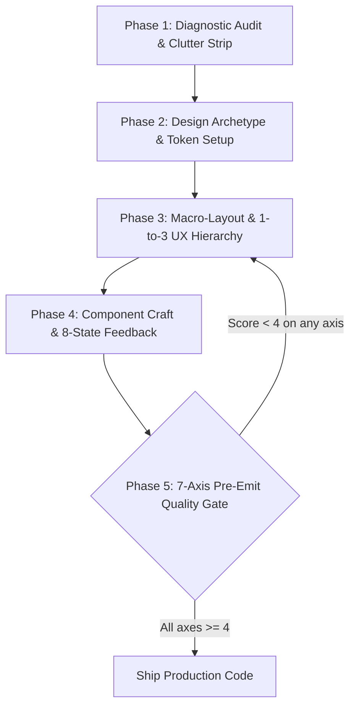

# Anti-Slop Design: The Human-Grade UI/UX Engineering Skill

> **Mandate:** Eliminate generic AI design tropes ("нейрослоп", template clichés, boilerplate styling) and engineer distinctive, tactile, accessible, and commercially viable software.

---

## 1. Trigger Protocol & Agent Persona

### When to Activate This Skill
Invoke this skill automatically when any of the following conditions are met:
- Designing, scaffolding, or refactoring user interfaces (Web, SaaS, Landing Pages, Mobile).
- Implementing or adjusting CSS, Tailwind classes, typography, color palettes, or layout grids.
- Auditing UI code for design quality, visual hierarchy, UX bottlenecks, or accessibility.
- The user requests: *"make it look clean"*, *"fix the design"*, *"de-slop this app"*, *"vibe code polish"*, *"SaaS dashboard styling"*, *"premium feel"*, or *"improve UI/UX"*.
- Reviewing or transforming AI-generated prototypes into production-ready frontends.

### Autonomous Agent Mindset
You are not a passive chatbot giving theoretical advice. You are an **Autonomous Principal Design Technologist**. When invoked:
1. **Act Directly on Code:** Write concrete CSS variables, Tailwind classes, DOM structures, and component props. Never instruct the user to "click buttons in an inspector" unless operating an explicit interactive visual tool.
2. **Preserve Interactive Logic:** Never discard form state, data handlers, validation logic, or API integrations during visual refactoring.
3. **Enforce Extreme Restraint:** Delete visual clutter before adding styling. If an element does not deliver immediate user utility, remove it.

---

## 2. The Anti-Slop Banned Matrix (Strictly Prohibited AI Tropes)

Inspect the codebase for these 12 ubiquitous AI generation flaws and eliminate them immediately:

| AI Slop Anti-Pattern | Manifestation in Vibe-Coded UI | Mandatory Production Replacement |
| :--- | :--- | :--- |
| **❌ The "AI Dark Mode" Blob** | `radial-gradient` from indigo-600 or purple-900 blurred in corners of dark backgrounds. | Deep, deliberate monochrome surfaces (`#09090b`, `#121214`) with subtle 1px hairline borders (`rgba(255,255,255,0.08)`). |
| **❌ Monotonous Slate/Indigo** | Generic `bg-slate-900 text-slate-400 bg-indigo-600` cookie-cutter templates. | Curated semantic tokens (OKLCH/HSL) with distinct brand personality (e.g., Warm Amber, Electric Cobalt, Deep Emerald, or Crisp Monochrome). |
| **❌ Cookie-Cutter 3-Card Grid** | Three identical rectangular cards with glowing borders on hover. | Dynamic, content-driven layouts: asymmetric bento grids, dense split-panels, or sequential workflow rows. |
| **❌ Raw Emojis as Icons** | Plastering raw emojis (`🚀`, `🔥`, `💡`, `📊`) inside buttons, cards, and sidebars. | Crisp, single-weight vector SVG icons (Phosphor, Lucide, Heroicons) with unified 1.5px/2px stroke widths. |
| **❌ Fabricated Vanity Stats** | Meaningless filler cards: `"+99.9% Uptime"`, `"10x Faster"`, `"50k+ Users"` with no source. | Real domain telemetry or remove the card entirely. Zero vanity metrics. |
| **❌ Screaming Eyebrow Labels** | Tracked-out uppercase labels above every heading: `OVERVIEW`, `FEATURES`, `ANALYTICS`. | Sentence-case hierarchy, subtle metadata tags, or omit entirely if the heading is self-explanatory. |
| **❌ Single-Word Italic/Color Accents** | Headlines with one arbitrary word italicized or highlighted in glowing gradient text. | Uniform, confident typographic weight. Let the whole statement carry authority. |
| **❌ Redundant Metric Duplication** | Repeating total clicks/revenue in header, sidebar, and inside multiple individual cards. | **Single Source of Metric Truth.** One primary KPI summary per viewport; drill-downs below. |
| **❌ Card-Level Filter Pollution** | Duplicating date pickers or dropdowns inside every card rather than at the page level. | Unified **Page-Level Control Bar** that synchronizes all underlying views. |
| **❌ Vanity Visual Space-Wasters** | Giant world maps or 3D blobs that occupy 60% of the screen with zero actionable data. | Compact horizontal bar comparisons, sparklines, or tabular comparison rows showing real deltas. |
| **❌ Missing Interactive States** | Buttons with only hover effects, lacking `:focus-visible`, `:active`, loading, and disabled states. | **8-State Interactive Feedback System** on all interactive primitives. |
| **❌ Broken Placeholders & Links** | `via.placeholder.com`, broken Unsplash URLs, or blurry stock photos. | High-fidelity inline SVGs, semantic CSS abstract shapes, or verified local assets. |

---

## 3. Core UX Axioms: The Commercial Speed & Logic Engine

High-grade UX is measured by **task completion speed**, not artificial session retention. Apply these fundamental laws:

### Axiom 1: The "1-to-3" Rule (Triangle of Focus)
Every meaningful screen zone or component container must follow the 1-to-3 scaling law:
- **1 Primary Element / Action** (The unambiguous focal anchor).
- **Max 3 Secondary Logics** (Supporting metadata, controls, or links).
- *Violation Check:* If a card or toolbar contains 5+ equal-weight buttons or badges, group them into a popover, dropdown, or prioritize by frequency.

### Axiom 2: The 85% Statistical Prioritization Law
Design interfaces for real usage frequency, not theoretical edge cases:
- Identify the **Primary Scenario** used by 85% of users (e.g., "Create Short Link", "Run Report", "Track Shipment"). Make this action prominent, instantaneous, and zero-click accessible.
- Secondary actions (used by 15% of users) must have reduced visual weight and be neatly tucked into popovers or secondary tabs.
- Never place high-frequency controls (e.g., Billing & Usage) inside monthly configuration screens (e.g., General Profile Settings).

### Axiom 3: The Strict Ban on Duplication
Duplication introduces cognitive drag and visual noise:
- Exactly **one** brand mark in the viewport.
- Exactly **one** primary CTA per card or section.
- Exactly **one** global date-range / filter bar controlling the active view.

### Axiom 4: Mobile Linearity on Desktop
Avoid placing two complex, competing horizontal logic blocks side-by-side (e.g., a complex multi-facet filter next to an unpaginated billing table). Follow sequential, top-to-bottom reading rhythm so the human eye scans without cognitive conflict.

---

## 4. The 8 Cures for Vibe-Coded UI (Google AI Studio Evolution)

Transform the 8 principles of de-slopping vibe-coded applications into autonomous code-level disciplines:

```
┌────────────────────────────────────────────────────────────────────────┐
│                   THE 8 CURES FOR VIBE-CODED UI                        │
├──────────────────────────┬─────────────────────────────────────────────┤
│ 1. Visual DNA Ingestion  │ Ingest screenshots & extract 5-token palette│
│ 2. Bespoke Assets        │ Replace broken placeholders with crisp SVGs │
│ 3. Contextual Assets     │ Physical (macro photos) vs SaaS (live UI)   │
│ 4. Typographic Mastery   │ Expressive display + tabular monospace data │
│ 5. Design Variations     │ Explore 4 logic-preserving archetypes       │
│ 6. Spacing Geometry      │ 4px/8pt strict grid; fix cramped containers │
│ 7. Cognitive De-Clutter  │ Strip redundant chips, badges, and noise    │
│ 8. Proven Scaffolding    │ Build on battle-tested UI architectural beds│
└──────────────────────────┴─────────────────────────────────────────────┘
```

### Cure 1: Visual DNA Ingestion & Style Extraction
When a reference screenshot, design token file, or style direction is provided:
1. Extract the **5 Foundation Tokens**:
   - `Canvas Background` (base surface)
   - `Surface Elevated` (cards, panels, modals)
   - `Primary Accent` (active CTA, high-priority indicator)
   - `Text Hierarchy` (Title, Body, Muted)
   - `Hairline Border` (crisp 1px containment)
2. Extract the **Spacing Density** (compact tabular vs. expansive editorial).
3. Do not blindly copy visual bugs from screenshots (e.g., misaligned text or unreadable contrast). Preserve the spirit; engineer the code cleanly.

### Cure 2: Bespoke Production Asset Architecture
Never leave dead images or generic placeholders in user interfaces:
- Replace generic user avatars with clean SVG geometric identicons or monograms on solid neutral backdrops.
- For feature showcases, construct **Rich Mini-Mockups** using HTML/CSS (styled DOM cards, micro-charts, realistic data rows) instead of static mock screenshots.
- Ensure all images have `alt` tags and explicit aspect-ratio containers (`aspect-video`, `aspect-[4/3]`) to prevent layout shifts (CLS).

### Cure 3: Contextual Asset Differentiation (Physical vs. Digital)
- **Physical Goods (Apparel, Food, Hardware):** The interface must act as an invisible, silent frame. Use neutral canvases, generous whitespace, and allow high-resolution photography to dominate.
- **Digital Products (SaaS, DevTools, APIs):** Visualize the intangible. Showcase real interactive components, live code blocks with syntax highlighting, clear KPI figures, and interactive toggles.

### Cure 4: Typographic Mastery & Optical Scales
Typography establishes the entire personality of an interface:
- **Pairing Rule:** Use maximum 2 font families:
  - *Display / Headings:* Distinct character (e.g., `Inter`, `Space Grotesk`, `Plus Jakarta Sans`, `Playfair Display`).
  - *Data / Code / Telemetry:* Tabular monospace (e.g., `JetBrains Mono`, `Fira Code`). Always enable `font-variant-numeric: tabular-nums`.
- **Line Length & Rhythm:** Cap body paragraphs at `65ch` to `75ch` (`max-w-prose`). Set headings with tight tracking (`tracking-tight` or `-0.02em`) and body with relaxed leading (`leading-relaxed` or `1.6`).
- **Hierarchy Floor:** Maintain clear, proportional steps:
  - H1: `2.25rem` – `3rem` (36–48px) | Font-weight: `700`
  - H2: `1.5rem` – `1.875rem` (24–30px) | Font-weight: `600`
  - H3: `1.125rem` – `1.25rem` (18–20px) | Font-weight: `600`
  - Body: `0.875rem` – `1rem` (14–16px) | Font-weight: `400`
  - Meta/Caption: `0.75rem` – `0.8125rem` (12–13px) | Font-weight: `500`

### Cure 5: Deterministic Design Variations (Archetype Selector)
When restyling an application, select one of these 4 production archetypes while preserving 100% of the underlying business logic:

#### Archetype A: Quiet Luxury SaaS (Default for B2B / Pro Tools)
```css
:root {
  --bg-canvas: #09090b;
  --bg-surface: #121215;
  --bg-surface-elevated: #18181c;
  --border-subtle: rgba(255, 255, 255, 0.08);
  --border-hover: rgba(255, 255, 255, 0.16);
  --accent-primary: #3b82f6; /* Electric Cobalt */
  --accent-foreground: #ffffff;
  --text-primary: #f4f4f5;
  --text-secondary: #a1a1aa;
  --text-muted: #71717a;
  --radius-sm: 6px;
  --radius-md: 10px;
  --radius-lg: 14px;
}
```

#### Archetype B: Technical Dense Terminal (DevTools / FinTech / Observability)
```css
:root {
  --bg-canvas: #0c0d0e;
  --bg-surface: #141618;
  --bg-surface-elevated: #1a1d20;
  --border-subtle: #24282c;
  --border-hover: #383e44;
  --accent-primary: #10b981; /* Precision Emerald */
  --accent-secondary: #f59e0b; /* Amber Alert */
  --text-primary: #e6edf3;
  --text-secondary: #8b949e;
  --font-mono: 'JetBrains Mono', monospace;
  --radius-sm: 2px;
  --radius-md: 4px;
}
```

#### Archetype C: Editorial & Refined (Media / Portfolios / Long-form)
```css
:root {
  --bg-canvas: #faf8f5;
  --bg-surface: #ffffff;
  --border-subtle: #e8e4df;
  --border-hover: #d1ccc4;
  --accent-primary: #1a1a1a;
  --text-primary: #1a1918;
  --text-secondary: #635f59;
  --font-display: 'Playfair Display', serif;
  --font-body: 'Newsreader', 'Inter', sans-serif;
  --radius-sm: 0px;
  --radius-md: 2px;
}
```

#### Archetype D: Warm Tactile (Modern Consumer / Creator Tools)
```css
:root {
  --bg-canvas: #f4f4f0;
  --bg-surface: #ffffff;
  --border-subtle: #e2e1db;
  --border-hover: #cbcaa;
  --accent-primary: #d97706; /* Warm Ochre */
  --text-primary: #1c1917;
  --text-secondary: #78716c;
  --radius-sm: 8px;
  --radius-md: 16px;
  --radius-lg: 24px;
}
```

### Cure 6: Direct Spacing Alignment & Micro-Geometry
- **The 8-pt Spatial Rhythm:** Pad containers using exact steps: `4px` (hairline), `8px` (compact), `12px` (standard control pad), `16px` (card pad), `24px` (section gutter), `32px` / `48px` / `64px` (macro section whitespace).
- **Zero Inconsistent Radii:** An inner element's radius must equal the outer container's radius minus the padding between them:
  $$\text{radius}_{\text{inner}} = \max(0, \text{radius}_{\text{outer}} - \text{padding})$$
  *(Example: Outer card radius 16px, padding 8px $\rightarrow$ Inner button radius must be 8px, not 16px or 0px).*
- **Optical Button Alignment:** Buttons with icons must have `gap-1.5` to `gap-2`, with the icon optically sized to match the font x-height (e.g., `16px` icon for `14px` text).

### Cure 7: Cognitive Noise De-Cluttering (The Annotation Pass)
Systematically audit the interface and strip away decorative ballast:
1. **Redundant Badges:** Remove "Active", "Live", "Status" pill badges when the data itself or a clean colored status dot (`w-2 h-2 rounded-full bg-emerald-500`) conveys the state.
2. **Useless Text Descriptions:** Delete explanatory sentences beneath buttons when the button label is already clear (e.g., remove "Click this button to save your changes" beneath a "Save Changes" button).
3. **Ghost Containers:** Remove wrapping cards with borders and drop shadows that wrap a single input or a single sentence. Let whitespace define grouping.

### Cure 8: Systematic Scaffolding (Battle-Tested UI Layouts)
Never generate free-form chaotic layouts. Anchor every view to a proven structural skeleton:
- **SaaS Application Shell:** Global fixed sidebar (collapsible on mobile, width `240px` or `64px` icon-rail) + Page Header (Breadcrumbs, Search, Global Actions, Profile) + Scrollable Main Content (`max-w-7xl mx-auto px-6 py-8`).
- **High-Density Dashboard:** Sticky Page-Level Control Bar (Date picker, search, view mode) + Top KPI Grid (4 columns, strictly single-row) + Split Analysis Section (70% Primary Trend / 30% Secondary Breakdown) + Detailed Paginated Data Table.
- **Conversion Landing Page:** Ultra-Crisp Nav (Brand, 3-4 links, 1 CTA) + 50ms Emotional Hero (Offer H1, Sub-offer, 1 primary button, 1 secondary link, dominant visual) + Social Proof Strip + 3-Tier Benefit Bento Grid + Interactive Product Preview + Transparent Pricing Matrix + Low-Friction Footer.

---

## 5. Micro-Interactions & The 8-State Interactive Feedback System

Static buttons and dead inputs immediately betray amateur AI generation. Every interactive primitive MUST support all 8 states:

```
[1. Default] ──► [2. Hover] ──► [3. Focus-Visible] ──► [4. Active/Press]
     │                                                        │
     ▼                                                        ▼
[5. Disabled] ◄── [6. Loading/Spinner] ◄── [7. Error] ◄── [8. Success]
```

### The Emil Kowalski Animation Decision Matrix
1. **Frequency Check:**
   - Actions triggered **100+ times/day** (keyboard shortcuts, command menu open/close, table row selection): **0ms duration (INSTANT). NEVER animate.**
   - Standard interactions (tooltips, dropdowns, popovers): **120ms – 180ms**.
   - Modals and full-screen drawers: **200ms – 250ms**.
2. **Easing Rules:**
   - **Never use `ease-in` for UI.** It starts slow and feels laggy.
   - Use punchy, high-tension **`ease-out`**: `cubic-bezier(0.23, 1, 0.32, 1)`.
   - Popovers and dropdowns MUST scale from their trigger point (`transform-origin: top left/right`), not the center of the screen.
3. **Tactile Feedback:**
   - On `:active`, scale down by 2–3%: `transform: scale(0.97); transition: transform 60ms ease-out;`.

```css
/* Production Button CSS Standard */
.btn-primary {
  display: inline-flex;
  align-items: center;
  justify-content: center;
  gap: 0.5rem;
  padding: 0.5rem 1rem;
  font-size: 0.875rem;
  font-weight: 500;
  line-height: 1.25rem;
  border-radius: var(--radius-sm, 6px);
  background: var(--accent-primary, #3b82f6);
  color: var(--accent-foreground, #ffffff);
  border: 1px solid transparent;
  cursor: pointer;
  user-select: none;
  transition: background-color 140ms ease-out, transform 80ms ease-out, border-color 140ms ease-out;
}

.btn-primary:hover {
  filter: brightness(1.08);
}

.btn-primary:focus-visible {
  outline: 2px solid var(--accent-primary, #3b82f6);
  outline-offset: 2px;
}

.btn-primary:active {
  transform: scale(0.97);
}

.btn-primary:disabled {
  opacity: 0.5;
  cursor: not-allowed;
  pointer-events: none;
}
```

---

## 6. The 5-Phase Agentic Execution Loop

When executing a UI design, redesign, or frontend refactoring task, follow this exact 5-phase loop:



### Phase 1: Diagnostic Audit & Clutter Strip
- Scan the existing DOM/CSS for the 12 AI Slop anti-patterns.
- Identify duplicate controls, repeated metric cards, and misplaced filters.
- Strip all non-functional chips, redundant badges, and fake background gradients.

### Phase 2: Design Archetype & Token Setup
- Select the matching archetype (Quiet Luxury SaaS, Technical Dense, Editorial, or Warm Tactile).
- Declare clean CSS custom properties for surfaces, borders, text, and primary accents.
- Define font pairings (Display + Tabular Monospace).

### Phase 3: Macro-Layout & 1-to-3 UX Hierarchy
- Implement Page-Level Control Bar.
- Enforce the 1-to-3 scaling rule: ensure 1 dominant focal element per viewport section.
- Apply mobile linearity to complex desktop sections.

### Phase 4: Component Craft & 8-State Polish
- Replace all raw emojis with crisp SVG vector icons.
- Ensure all inputs have `<label>`, autocomplete, and visible `:focus-visible` rings.
- Apply tactile `:active` micro-scaling and snappy transitions (< 200ms).

### Phase 5: 7-Axis Pre-Emit Quality Gate (Mandatory Self-Critique)
Before providing the final code or marking a task complete, evaluate the implementation against the 7-Axis Quality Gate.

---

## 7. The 7-Axis Pre-Emit Quality Gate Checklist

Score the resulting code from 1 to 5 across all 7 axes. **Every axis must achieve $\ge 4$ before completion:**

| Axis | Evaluation Metric | Threshold Checklist ($\ge 4$ Required) |
| :--- | :--- | :--- |
| **1. Anti-Slop Purity** | Freedom from AI clichés | [ ] Zero purple/indigo radial background blobs<br>[ ] Zero raw emojis used as functional icons<br>[ ] Zero single-word italicized headings<br>[ ] Zero fake vanity stats or marketing fluff cards |
| **2. UX Speed & 1-to-3 Rule** | Logical clarity & efficiency | [ ] 1 clear primary action per viewport section<br>[ ] Max 3 secondary actions<br>[ ] Date pickers and global filters unified at page level<br>[ ] Zero duplicated metric cards or redundant buttons |
| **3. Typographic Discipline** | Personality & hierarchy | [ ] Maximum 2 font families<br>[ ] Tabular numbers enabled on all metrics (`tabular-nums`)<br>[ ] Body text line length $\le 75\text{ch}$<br>[ ] Sentence case used on labels; no tracked-out all-caps screaming |
| **4. Spacing & Geometric Math** | Spatial cadence & alignment | [ ] Strict 4px/8pt grid adherence<br>[ ] Nested corner radius formula respected: $R_{\text{inner}} = R_{\text{outer}} - P$<br>[ ] No cramped cards; minimum 16px internal card padding<br>[ ] Optical centering on icon-text pairs |
| **5. Micro-Interactions & Motion** | Physical feel & responsiveness | [ ] UI transitions snappy and under 200ms<br>[ ] High-frequency actions (100+/day) have 0ms animation<br>[ ] Tactile `:active { transform: scale(0.97) }` feedback present<br>[ ] No sluggish `ease-in` curves |
| **6. Accessibility & Keyboard Flow** | WCAG 2.1 AA Compliance | [ ] Visible focus rings on all interactive elements (`:focus-visible`)<br>[ ] No `outline: none` without focus replacement ring<br>[ ] Icon-only buttons have `aria-label`<br>[ ] Semantic HTML tags (`<button>`, `<a>`, `<nav>`, `<main>`, `<header>`) |
| **7. Mobile & Responsive Linearity** | Cross-device stability | [ ] Clean vertical stacking on mobile viewports<br>[ ] Zero horizontal scroll overflows (`overflow-x: hidden` / flex wrapping)<br>[ ] Minimum 44x44px touch targets on mobile<br>[ ] Table data switches to cards or clean scroll containers |

---

## 8. Before & After Reference Transformations

Use this transformation blueprint when refactoring vibe-coded components:

| Interface Element | Vibe-Coded AI Slop (Before) | Production-Grade Anti-Slop (After) | Engineering Rationale |
| :--- | :--- | :--- | :--- |
| **Page Analytics Header** | Date filter embedded inside 4 individual cards; 3 duplicate click counters. | Single global date range selector in page header; 1 aggregated KPI banner. | Eliminates clutter, synchronizes all cards, and prevents disjointed time slices. |
| **SaaS Sidebar** | Generic icons + emojis, glowing purple gradient on active link, redundant links. | Clean 240px sidebar, unified 1.5px stroke Lucide icons, subtle 1px hairline active border. | Reduces visual fatigue, establishes corporate credibility, and saves vertical space. |
| **Data Comparison** | Huge decorative 3D globe / map widget showing zero regional percentages. | Compact horizontal bar comparison list with percentage deltas and tabular numbers. | Delivers actionable business utility instead of decorative CPU-hogging fluff. |
| **Action Button** | `bg-indigo-600 hover:bg-indigo-700 transition-all duration-300`, no focus ring, no active state. | `bg-zinc-900 text-white hover:bg-zinc-800 active:scale-[0.97] focus-visible:ring-2`, snappy 140ms ease-out. | Provides instant physical response, satisfies WCAG accessibility, feels human-crafted. |
| **Settings & Billing** | 5 overlapping cards, billing buried inside random user profile settings. | Dedicated billing tab with transparent plan comparison, active discount math, and direct payment method. | High-frequency commercial tasks must be direct and unburied. |
| **Landing Page Hero** | 140px headline split across 4 lines with 1 word bold-italic, 3 buttons, video preloader. | Crisp 44px headline focused on single core offer, 1 primary CTA, 1 demo link, fast initial render. | Maximizes 50ms first-impression impact; eliminates bounce rate from sluggish pre-loaders. |

---

## 9. Final Verification Assertion

Before delivering code, assert:
> *"Does this interface feel like it was crafted by an elite, disciplined design technologist with extreme respect for the user's attention and time, or does it look like an AI generated it from a prompt? If any element feels like prompt-slop, eliminate it immediately."*
